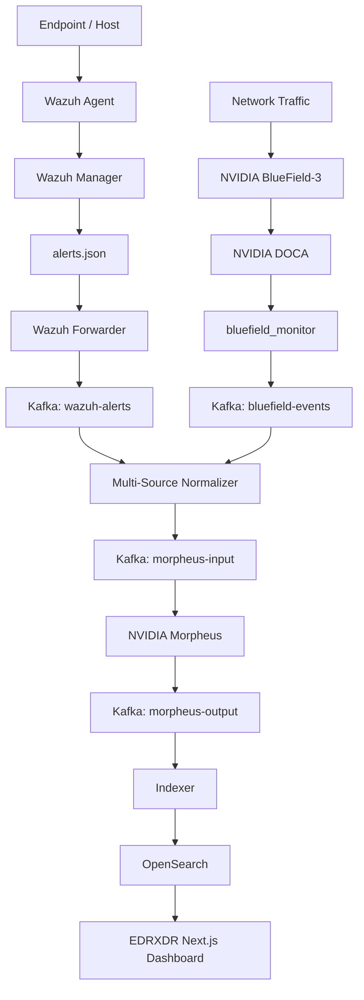

# EDRXDR — Intelligent Threat Detection Pipeline

ระบบต้นแบบ **EDR/XDR Intelligent Threat Detection Pipeline** สำหรับรวบรวม วิเคราะห์ และแสดงผลข้อมูลด้าน Cybersecurity จากทั้งฝั่ง **Endpoint Security** และ **Network Security**

ระบบผสานเทคโนโลยี:

- Wazuh
- NVIDIA BlueField-3
- NVIDIA DOCA
- Apache Kafka
- NVIDIA Morpheus
- NVIDIA H100
- OpenSearch
- Next.js

เป้าหมายคือรวบรวม Security Events จากหลายแหล่งให้อยู่ในรูปแบบเดียวกัน ก่อนส่งเข้าสู่ NVIDIA Morpheus สำหรับ GPU-accelerated Threat Analysis และแสดงผลผ่าน Unified EDR/XDR Dashboard

---

# Architecture



---

# Current Data Flow

```text
                   ENDPOINT / HOST
                         │
                         ▼
                    Wazuh Agent
                         │
                         ▼
                   Wazuh Manager
                         │
                         ▼
                    alerts.json
                         │
                         ▼
                  Wazuh Forwarder
                         │
                         ▼
                Kafka: wazuh-alerts
                         │
                         │
                         ├──────────────────┐
                                            │
                 NETWORK                    │
                    │                       │
                    ▼                       │
            NVIDIA BlueField-3              │
                    │                       │
                    ▼                       │
               NVIDIA DOCA                  │
                    │                       │
                    ▼                       │
            bluefield_monitor               │
                    │                       │
                    ▼                       │
         Kafka: bluefield-events ───────────┤
                                            │
                                            ▼
                                  Multi-Source Normalizer
                                            │
                                            ▼
                                   Kafka: morpheus-input
                                            │
                                            ▼
                                    NVIDIA Morpheus
                                   GPU Threat Analysis
                                            │
                                            ▼
                                  Kafka: morpheus-output
                                            │
                                            ▼
                                         Indexer
                                            │
                                            ▼
                                        OpenSearch
                                            │
                                            ▼
                                   EDRXDR Dashboard
```

---

# Project Objectives

ระบบถูกออกแบบเพื่อรองรับ:

- Endpoint Detection and Response
- Extended Detection and Response
- Security Log Collection
- Authentication Monitoring
- File Integrity Monitoring
- Vulnerability Detection
- Network Telemetry
- DPU-based Security Monitoring
- Real-time Event Streaming
- Multi-source Event Normalization
- GPU Security Analytics
- Threat Classification
- Threat Scoring
- MITRE ATT&CK Mapping
- Security Event Storage
- Unified Security Dashboard
- Automated Response ในขั้นถัดไป

---

# 1. Wazuh Endpoint Security

Wazuh ทำหน้าที่เป็น Endpoint Security / EDR Layer ของระบบ

Wazuh ใช้สำหรับ:

- Security Logs
- Authentication Events
- SSH Events
- sudo / PAM Events
- File Integrity Monitoring
- Vulnerability Detection
- Security Rules
- Security Alerts
- MITRE ATT&CK Mapping

Pipeline:

```text
Wazuh Agent
    ↓
Wazuh Manager
    ↓
alerts.json
    ↓
Wazuh Forwarder
    ↓
Kafka: wazuh-alerts
```

ตัวอย่าง Alert ที่ระบบตรวจพบจริง:

```text
Rule 5402
Successful sudo to ROOT executed.

Rule 5501
PAM: Login session opened.

Rule 5502
PAM: Login session closed.

Rule 5715
sshd: authentication success.
```

ตัวอย่าง Wazuh Alert:

```json
{
  "rule": {
    "level": 3,
    "description": "Successful sudo to ROOT executed.",
    "id": "5402",
    "mitre": {
      "id": [
        "T1548.003"
      ],
      "tactic": [
        "Privilege Escalation",
        "Defense Evasion"
      ],
      "technique": [
        "Sudo and Sudo Caching"
      ]
    }
  },
  "agent": {
    "id": "001",
    "name": "oa-hgx-h100-bu-02"
  }
}
```

Wazuh Manager สร้าง Alert ที่:

```text
/var/ossec/logs/alerts/alerts.json
```

จากนั้น Wazuh Forwarder ส่ง Alert เข้า Kafka Topic:

```text
wazuh-alerts
```

---

# 2. NVIDIA BlueField-3

NVIDIA BlueField-3 ทำหน้าที่เป็น Network / DPU Telemetry Source

Hardware ที่ตรวจพบ:

```text
NVIDIA BlueField-3
Integrated ConnectX-7 Network Controller
```

ตรวจสอบ Hardware:

```bash
lspci | grep -Ei "BlueField|Mellanox|ConnectX"
```

Network Interfaces:

```text
mlx5_0
→ enp6s17f0np0

mlx5_1
→ enp6s17f1np1
```

---

# 3. NVIDIA DOCA

NVIDIA DOCA ใช้สำหรับเข้าถึง BlueField Device และประมวลผล Network Telemetry

ตรวจสอบ DOCA Devices:

```bash
sudo /opt/mellanox/doca/tools/doca_caps --list-devs
```

ตัวอย่าง:

```text
PCI: 0000:06:11.0
ibdev_name: mlx5_0
iface_name: enp6s17f0np0

PCI: 0000:06:11.1
ibdev_name: mlx5_1
iface_name: enp6s17f1np1
```

---

# 4. BlueField Monitor

`bluefield_monitor` พัฒนาด้วยภาษา C

หน้าที่:

- อ่าน RX Packets
- อ่าน TX Packets
- อ่าน RX Bytes
- อ่าน TX Bytes
- อ่าน RX Errors
- อ่าน TX Errors
- สร้าง JSON Telemetry
- ส่งข้อมูลไปยัง Kafka

ตัวอย่าง:

```json
{
  "timestamp": "2026-09-16T17:31:56Z",
  "source": "bluefield",
  "ibdev": "mlx5_0",
  "interface": "enp6s17f0np0",
  "rx_packets": 0,
  "tx_packets": 0,
  "rx_bytes": 0,
  "tx_bytes": 0,
  "rx_errors": 0,
  "tx_errors": 0
}
```

ข้อมูลจะถูกส่งเข้าสู่:

```text
Kafka: bluefield-events
```

---

# 5. Apache Kafka

Apache Kafka เป็น Event Streaming Layer หลักของระบบ

Kafka Topics:

```text
bluefield-events
wazuh-alerts
morpheus-input
morpheus-output
```

ตรวจสอบ:

```bash
docker exec edrxdr-kafka \
  /opt/kafka/bin/kafka-topics.sh \
  --bootstrap-server localhost:9092 \
  --list
```

## bluefield-events

รับ Raw Network Telemetry จาก:

```text
BlueField-3
↓
DOCA
↓
bluefield_monitor
```

## wazuh-alerts

รับ Endpoint Security Alerts จาก:

```text
Wazuh Manager
↓
alerts.json
↓
Wazuh Forwarder
```

## morpheus-input

รับ Event ที่ผ่าน Multi-Source Normalizer แล้ว

```text
BlueField Events ──┐
                   ├──→ Normalizer → morpheus-input
Wazuh Alerts ──────┘
```

## morpheus-output

ใช้รับผล Threat Analysis จาก NVIDIA Morpheus

```text
NVIDIA Morpheus
↓
morpheus-output
```

---

# 6. Multi-Source Normalizer

Normalizer รับข้อมูลจากทั้ง:

```text
bluefield-events
wazuh-alerts
```

พร้อมกัน

แล้วแปลงให้อยู่ใน Common EDR/XDR Schema

```text
bluefield-events ─────┐
                      │
                      ├──→ Multi-Source Normalizer
                      │             ↓
wazuh-alerts ─────────┘       morpheus-input
```

ตัวอย่าง Wazuh Normalized Event:

```json
{
  "event_type": "endpoint_security_alert",
  "source_type": "wazuh",
  "source_product": "wazuh",
  "rule_id": "5402",
  "rule_level": 3,
  "rule_description": "Successful sudo to ROOT executed.",
  "agent_name": "oa-hgx-h100-bu-02",
  "mitre_id": [
    "T1548.003"
  ],
  "mitre_tactic": [
    "Privilege Escalation",
    "Defense Evasion"
  ]
}
```

ตัวอย่าง BlueField Normalized Event:

```json
{
  "event_type": "network_telemetry",
  "source_type": "bluefield",
  "source_product": "nvidia-bluefield-3",
  "ibdev": "mlx5_0",
  "interface": "enp6s17f0np0",
  "rx_packets": 0,
  "tx_packets": 0,
  "rx_bytes": 0,
  "tx_bytes": 0
}
```

---

# 7. NVIDIA Morpheus

NVIDIA Morpheus ทำหน้าที่เป็น GPU Security Analytics Layer

Pipeline ที่เตรียมไว้:

```text
morpheus-input
      ↓
Deserialize
      ↓
GPU Processing
      ↓
Threat Analysis
      ↓
Threat Classification
      ↓
Threat Score
      ↓
Serialize
      ↓
morpheus-output
```

Morpheus Container:

```text
nvcr.io/nvidia/morpheus/morpheus:25.06-runtime
```

---

# Current NVIDIA H100 Status

ระบบสามารถตรวจพบ:

```text
NVIDIA H100 80GB HBM3
```

แต่ GPU Fabric ยังเป็น:

```text
Fabric
    State  : In Progress
    Status : N/A
```

ทำให้ NVIDIA Morpheus / cuDF ยังไม่สามารถ Initialize CUDA ได้

Error:

```text
cudaErrorSystemNotReady:
system not yet initialized
```

สถานะที่ต้องการคือ:

```text
Fabric
    State  : Completed
    Status : Success
```

เมื่อ GPU Fabric พร้อม ระบบจะสามารถเปิด:

```text
morpheus-input
      ↓
NVIDIA Morpheus
      ↓
GPU Threat Analysis
      ↓
morpheus-output
```

ได้จริง

---

# No Simulator / No Fallback

โปรเจกต์นี้ไม่ใช้ Morpheus Simulator หรือ Fallback

ข้อมูลจำลองเดิม เช่น:

```text
threat_score: 0.82
threat_class: suspicious
analysis_engine: morpheus-simulator
```

ถูกลบออกจาก OpenSearch แล้ว

ดังนั้นหาก NVIDIA Morpheus ยังไม่พร้อม Dashboard จะแสดง:

```text
Morpheus: Waiting
Threat Score: Waiting
```

แทนการสร้างผลลัพธ์จำลอง

---

# 8. Indexer

Indexer จะรับข้อมูลจาก:

```text
Kafka: morpheus-output
```

แล้วส่งเข้าสู่ OpenSearch

```text
morpheus-output
      ↓
Indexer
      ↓
OpenSearch
```

Indexer พร้อมทำงานเมื่อ NVIDIA Morpheus เริ่มส่งข้อมูลจริง

---

# 9. OpenSearch

OpenSearch ใช้เป็น Security Event Storage

ตรวจสอบ:

```bash
curl http://localhost:9200
```

Index Naming:

```text
edrxdr-events-YYYY.MM.DD
```

ค้นหา Event:

```bash
curl \
  "http://localhost:9200/edrxdr-events-*/_search?pretty"
```

---

# 10. Unified EDRXDR Dashboard

Dashboard หลักพัฒนาด้วย:

```text
Next.js
React
TypeScript
Tailwind CSS
```

เปิด Development Server:

```bash
cd frontend

npm install

npm run dev -- \
  --hostname 0.0.0.0 \
  --port 3000
```

เปิด Dashboard:

```text
http://HOST_IP:3000
```

Dashboard รวมข้อมูลจากทั้ง Wazuh และ NVIDIA BlueField ในหน้าเดียว

แสดง:

- Wazuh Agent Status
- Wazuh Manager Status
- Wazuh Forwarder Status
- Wazuh Alerts
- Wazuh Rule ID
- Wazuh Rule Level
- MITRE ATT&CK
- NVIDIA BlueField-3 Status
- NVIDIA DOCA Status
- Kafka Status
- Normalizer Status
- NVIDIA Morpheus Status
- H100 GPU Fabric Status
- Indexer Status
- OpenSearch Status
- Unified EDRXDR Pipeline

---

# Wazuh Native Dashboard

Wazuh Native Dashboard ยังถูกใช้สำหรับ Administration / Debugging

เปิด:

```text
https://HOST_IP:8443
```

ส่วน Dashboard หลักของโปรเจกต์คือ:

```text
http://HOST_IP:3000
```

ดังนั้น:

```text
Wazuh Dashboard
→ Administration / Debugging

EDRXDR Dashboard
→ Unified SOC / Security Monitoring
```

---

# Project Structure

```text
EDRXDR-Morpheus/
│
├── bluefield-agent/
│   ├── meson.build
│   │
│   └── src/
│       ├── bluefield_monitor.c
│       └── bluefield_probe.c
│
├── frontend/
│   ├── package.json
│   ├── package-lock.json
│   │
│   └── src/
│       └── app/
│           ├── page.tsx
│           │
│           └── api/
│               ├── events/
│               │   └── route.ts
│               │
│               ├── status/
│               │   └── route.ts
│               │
│               └── wazuh/
│                   └── route.ts
│
├── normalizer/
│   ├── Dockerfile
│   ├── normalizer.py
│   └── requirements.txt
│
├── indexer/
│   ├── Dockerfile
│   ├── indexer.py
│   └── requirements.txt
│
├── morpheus/
│   └── start.sh
│
├── wazuh/
│   ├── .env.example
│   ├── docker-compose.yml.example
│   │
│   ├── forwarder/
│   │   ├── Dockerfile
│   │   ├── forwarder.py
│   │   └── requirements.txt
│   │
│   └── config/
│       └── wazuh_dashboard/
│           └── wazuh.yml.example
│
├── compose.yml
├── .env.example
├── .gitignore
└── README.md
```

---

# Current Project Status

| Component | Status |
|---|---|
| Wazuh Agent | ✅ Working |
| Wazuh Manager | ✅ Working |
| Wazuh Indexer | ✅ Working |
| Wazuh Dashboard | ✅ Working |
| Wazuh Forwarder | ✅ Working |
| Kafka `wazuh-alerts` | ✅ Working |
| NVIDIA BlueField-3 | ✅ Detected / Working |
| NVIDIA DOCA | ✅ Working |
| BlueField Monitor | ✅ Working |
| Kafka `bluefield-events` | ✅ Working |
| Apache Kafka | ✅ Working |
| Multi-Source Normalizer | ✅ Working |
| Kafka `morpheus-input` | ✅ Wazuh + BlueField |
| NVIDIA H100 | ✅ Detected |
| H100 GPU Fabric | ⏳ In Progress |
| NVIDIA Morpheus | ⏳ Waiting for GPU Fabric |
| Kafka `morpheus-output` | ⏳ Waiting for Morpheus |
| Indexer | ✅ Ready |
| OpenSearch | ✅ Working |
| Unified EDRXDR Dashboard | ✅ Working |
| Morpheus Simulator | ❌ Removed |
| Fallback Threat Analysis | ❌ Not used |
| Automated Response | ⏳ Planned after Morpheus |

---

# Current Working Pipeline

```text
Wazuh Agent ✅
    ↓
Wazuh Manager ✅
    ↓
alerts.json ✅
    ↓
Wazuh Forwarder ✅
    ↓
wazuh-alerts ✅
    │
    │
    ├────────────────────────┐
                             │
BlueField-3 ✅                │
    ↓                        │
DOCA ✅                      │
    ↓                        │
bluefield_monitor ✅         │
    ↓                        │
bluefield-events ✅ ─────────┤
                             ▼
                      Normalizer ✅
                             ↓
                     morpheus-input ✅
                             ↓
                     Morpheus ⏳
                             ↓
                    morpheus-output
                             ↓
                         Indexer
                             ↓
                       OpenSearch
                             ↓
                   EDRXDR Dashboard ✅
```

---

# Automated Response

Automated Response ถูกวางไว้เป็นขั้นถัดไป หลังจาก NVIDIA Morpheus สามารถทำ GPU Threat Analysis จริงได้

เป้าหมายคือใช้ข้อมูลจากหลายแหล่งร่วมกัน:

```text
Wazuh Alert Severity
        +
Morpheus Threat Score
        +
Morpheus Classification
        +
BlueField Network Context
        ↓
Automated Response Engine
```

ตัวอย่าง Response:

```text
Alert
Investigate
Block IP
Isolate Host
Create Incident
Incident Report
```

เหตุผลที่ยังไม่เปิด Automated Response จริงในปัจจุบัน คือระบบต้องการใช้ผลจาก NVIDIA Morpheus จริงประกอบการตัดสินใจก่อนดำเนินการ Response ที่มีผลต่อระบบ

---

# Security

Repository จะไม่เก็บ Passwords, Tokens, Certificates หรือ Private Keys จริง

ไฟล์ Local Only:

```text
wazuh/.env
wazuh/docker-compose.yml
wazuh/config/wazuh_dashboard/wazuh.yml
wazuh/config/wazuh_indexer_ssl_certs/
```

ไฟล์เหล่านี้ถูกเพิ่มใน:

```text
.gitignore
```

Repository จะเก็บเฉพาะ Template:

```text
wazuh/.env.example
wazuh/docker-compose.yml.example
wazuh/config/wazuh_dashboard/wazuh.yml.example
```

ตัวอย่าง Environment Template:

```env
WAZUH_INDEXER_PASSWORD=CHANGE_ME
WAZUH_API_PASSWORD=CHANGE_ME
WAZUH_DASHBOARD_PASSWORD=CHANGE_ME
```

ห้าม Commit:

```text
.env
Private Keys
Certificates
API Tokens
Passwords
Secrets
```

ขึ้น GitHub

---

# Technology Stack

## Security

```text
Wazuh
NVIDIA Morpheus
MITRE ATT&CK
```

## NVIDIA

```text
NVIDIA BlueField-3
NVIDIA ConnectX-7
NVIDIA DOCA
NVIDIA DPDK
NVIDIA H100
NVIDIA Morpheus
```

## Data Pipeline

```text
Apache Kafka
Python
C
Docker
Docker Compose
```

## Storage

```text
OpenSearch
```

## Frontend

```text
Next.js
React
TypeScript
Tailwind CSS
```

---

# Next Steps

## 1. Fix H100 GPU Fabric

สถานะปัจจุบัน:

```text
State  : In Progress
Status : N/A
```

เป้าหมาย:

```text
State  : Completed
Status : Success
```

---

## 2. Enable NVIDIA Morpheus

เมื่อ H100 Fabric พร้อม:

```text
morpheus-input
      ↓
NVIDIA Morpheus
      ↓
GPU Threat Analysis
      ↓
Threat Score
      ↓
Threat Classification
      ↓
morpheus-output
```

---

## 3. Validate End-to-End AI Pipeline

ทดสอบ:

```text
Wazuh
   ┐
   │
   ├→ Normalizer
   │      ↓
BlueField ┘  morpheus-input
              ↓
          Morpheus
              ↓
        morpheus-output
              ↓
           Indexer
              ↓
         OpenSearch
              ↓
          Dashboard
```

---

## 4. Automated Response

หลัง Morpheus พร้อม จะพัฒนา Response Playbook:

```text
Threat Detected
      ↓
Risk Evaluation
      ↓
Response Decision
      ↓
┌───────────────┬────────────────┐
│               │                │
▼               ▼                ▼
Alert        Block IP       Isolate Host
│
▼
Incident Report
```

---

# Project Summary

ปัจจุบัน EDRXDR Pipeline สามารถรับ Security Events จากทั้ง:

```text
Wazuh Endpoint Security
```

และ:

```text
NVIDIA BlueField-3 / DOCA Network Telemetry
```

ได้พร้อมกัน

ข้อมูลจากทั้งสองแหล่งสามารถไหลผ่าน:

```text
Wazuh / BlueField
        ↓
Apache Kafka
        ↓
Multi-Source Normalizer
        ↓
morpheus-input
```

ได้สำเร็จแล้ว

Unified Dashboard สามารถแสดง Wazuh Endpoint Alerts และสถานะ BlueField / DOCA Pipeline ในหน้าเดียวกันได้

ส่วนที่เหลือคือการแก้ไข **NVIDIA H100 GPU Fabric** เพื่อเปิด NVIDIA Morpheus สำหรับ GPU Threat Analysis จริง

หลังจาก Morpheus พร้อม จะพัฒนา **Automated Response / Response Playbook** ต่อ เพื่อให้ระบบ EDR/XDR สามารถตรวจจับ วิเคราะห์ และตอบสนองต่อภัยคุกคามได้แบบ End-to-End

---

## License

โปรเจกต์นี้จัดทำขึ้นเพื่อการศึกษา การวิจัย และการพัฒนาต้นแบบด้าน:

- Cybersecurity
- EDR / XDR
- NVIDIA BlueField
- NVIDIA DOCA
- NVIDIA Morpheus
- GPU / DPU Security Analytics
